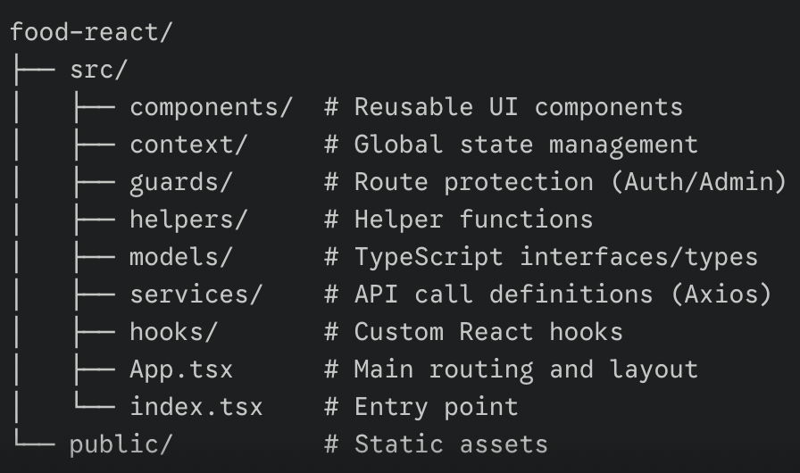

# 🥗 FoodApp Frontend


FoodApp Frontend is a modern **React + TypeScript** Single Page Application (SPA) designed for a seamless food ordering experience. It provides a responsive interface for customers to browse menus and an integrated admin panel for management.

---

## 📌 Project Overview

The application is built with performance and type-safety in mind:

- 🛒 **Ordering Flow:** Smooth menu browsing, cart management, and checkout.
- 🔐 **Authentication:** Secure user login and registration using JWT.
- 🛡️ **Guards:** Protected routes for Admin and User roles.
- 💳 **Payments:** Integrated with Stripe for secure transactions.
- 📱 **Responsive:** Fully optimized for Desktop, Tablet, and Mobile devices.

---

## 🛠 Technology Stack

* **Core:** React 18, TypeScript.
* **Routing:** React Router DOM.
* **State Management:** Context API + Custom Hooks.
* **Data Fetching:** Axios.
* **Styling:** CSS Modules / Tailwind (Responsive Design).
* **Deployment:** Netlify with CI/CD.

---

## ⚙️ Setup and Development

### 1. Clone the Repository

```
git clone `<repo>`
cd food-react
npm install
```

**2. Install Dependencies**

```bash
npm start
```

### 3. Environment Variables

Create a `.env.dev` file for local development:

```env
REACT_APP_API_URL=http://localhost:8080/api
REACT_APP_MENU=http://localhost:8080/uploads/menu/
```

Create a `.env.prod` for production:

```
REACT_APP_API_URL=[https://online-food-ordering-system-1-m18j.onrender.com/api](https://online-food-ordering-system-1-m18j.onrender.com/api)
REACT_APP_MENU=[https://online-food-ordering-system-1-m18j.onrender.com/uploads/menu/](https://online-food-ordering-system-1-m18j.onrender.com/uploads/menu/)
```

**4. Run Locally**

```npm
npm start
```

The app will be available at `http://localhost:3000`.

## 🚀 Deployment

### Netlify Deployment

1. Connect your GitHub repository to  **Netlify** .
2. **Build Command:**`npm run build `
3. **Publish Directory:** `build/`
4. Add environment variables in the Netlify dashboard.

📂 Folder Structure



## 🔗 Quick Links

```m
* **Live Demo:** [Netlify App](https://online-food-app-react.netlify.app/home)
* **Backend Repository:** [GitHub - food-backend](https://github.com/mustafaguler3/online-food-ordering-system)
```
