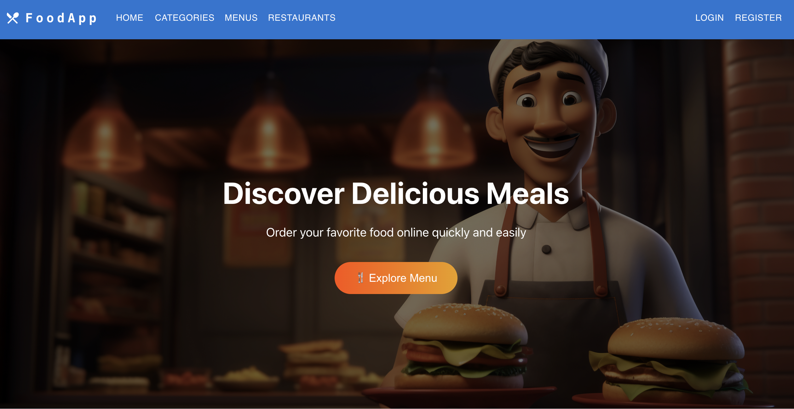
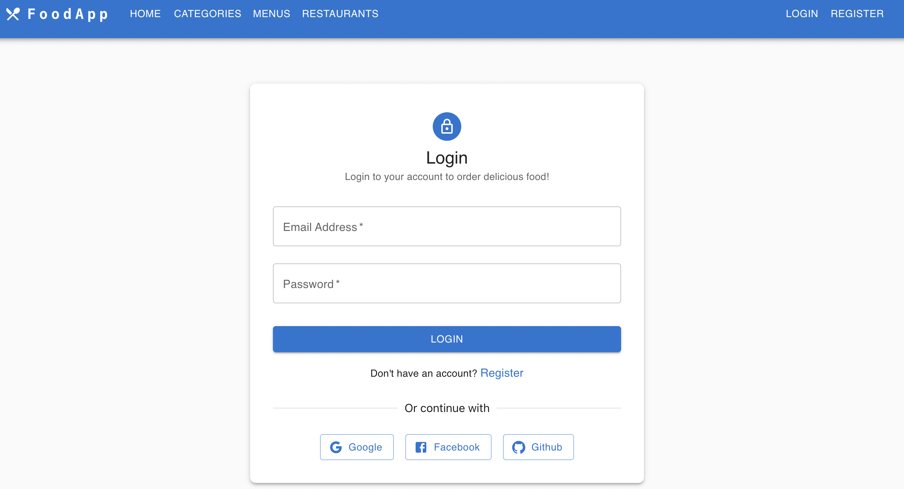
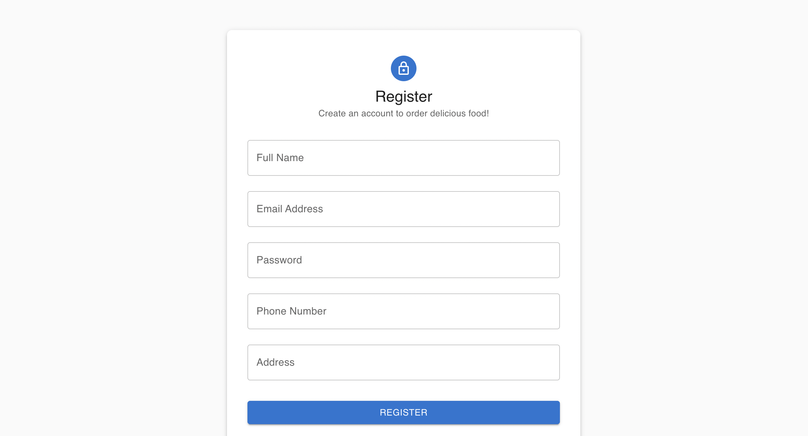

# FoodApp Frontend

## 📌 Project Overview

FoodApp Frontend is a React + TypeScript Single Page Application (SPA) for a food ordering system.It supports:

- Menu and category browsing
- Cart and order management
- Admin panel functionalities
- Stripe-based payments
- JWT authentication for users

This project connects to the FoodApp backend API and provides a responsive interface for both customers and admins.

## 🛠 Technology Stack

- **React 18 + TypeScript**
- **React Router DOM**
- **Axios** for API requests
- **Context API + Hooks** for state management
- **ESLint + Prettier** for code quality
- **Netlify** for production deployment
- **GitHub Actions** for CI/CD pipeline

## ⚙️ Setup and Development

### 1. Clone Repository

1 - git clone `<frontend-repo-url>`
2 - cd food-react
3 - npm install

### **2. Run Locally**

****npm start**
**This will start the app at [http://localhost:3000](http://localhost:3000)

### **3. Environment Variables**

Create **.env.dev** for development:

**REACT_APP_API_URL=http://localhost:8080/api
REACT_APP_MENU=http://localhost:8080/uploads/menu/
**

Create **.env.prod** for production:

REACT_APP_API_URL=https://online-food-ordering-system-1-m18j.onrender.com/api
REACT_APP_MENU=https://online-food-ordering-system-1-m18j.onrender.com/uploads/menu/

### **4. Build**

npm run build

This generates a production-ready build in the **build/** folder.

## **🚀 Deployment**

### **Netlify Deployment**

* Create a new site on Netlify and connect your GitHub repository.
* Set the build command: **npm run build**
* Set the publish directory: **build/**
* Add environment variables from **.env.prod** in Netlify dashboard
* Netlify will automatically build and deploy your app

**Important:** Since this is a SPA, configure redirects so that all routes point to **index.html**.

Use a _redirects** file or **netlify.toml**:**

### **CI/CD via GitHub Actions**

* Optional: Automate build and deploy using GitHub Actions
* Trigger on **main** or **feature/ci-cd** branch
* Steps:
  1. Checkout code
  2. Install dependencies **npm install**
  3. **Run tests **npm run test
  4. **Build **npm run build
  5. Deploy to Netlify (can use Netlify CLI or API)

## **🧪 Testing**

* Run tests locally:

npm run test

## **🔑 Notes**

* Ensure that all environment variables are set correctly for the current environment.
* Clean up unused variables and React hook warnings to avoid build failures on Netlify.
* This project uses React SPA routing; proper redirect configuration is required in production hosting.

* ESLint and TypeScript checks are enforced during build; unused variables or missing hook dependencies can fail the build.

## **📂 Folder Structure**

food-react/

**├── **public**/**

├── src/

│ **  **├── components/

│ **  **├── context/

│ **  **├── guards/

│ **  **├── helpers/

│ **  **├── models/

│ **  **├── utils/

│ **  **├── services/

│ **  **├── hooks/

│ **  **├── App.tsx

│ **  **└── index.tsx

├── .env.dev

├── .env.prod

├── **package**.json

├── tsconfig.json

└── README.md

**ScreenShots**

**Frontend -> https://online-food-app-react.netlify.app/**

**Backend -> https://github.com/mustafaguler3/online-food-ordering-system.git**
